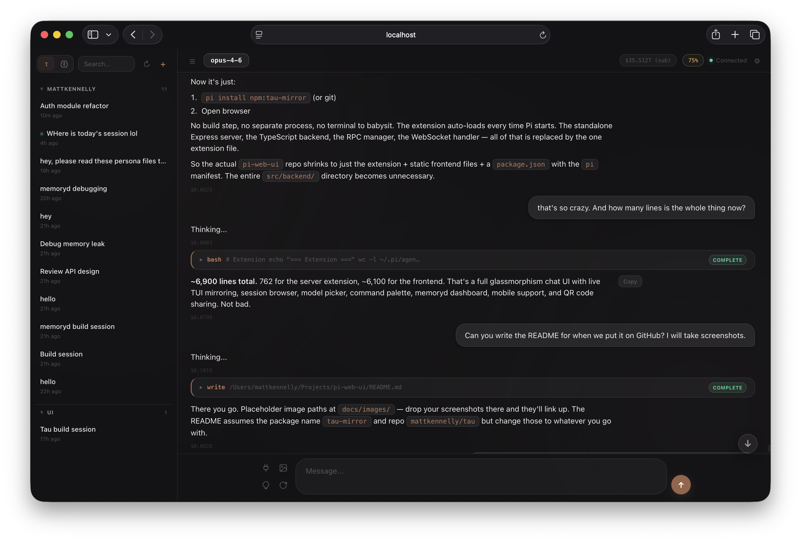
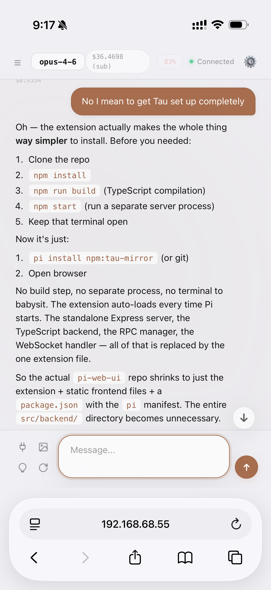
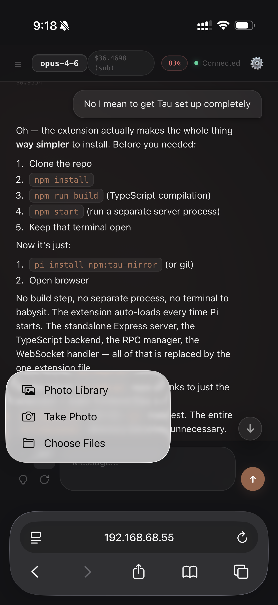
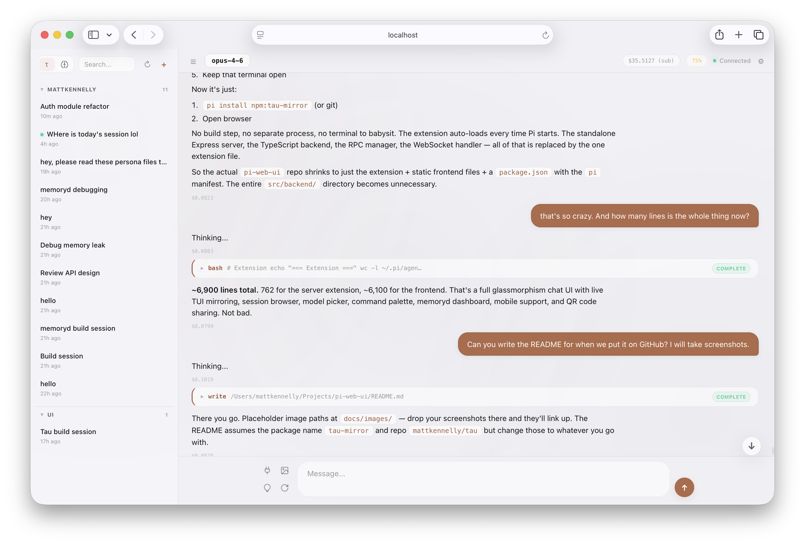
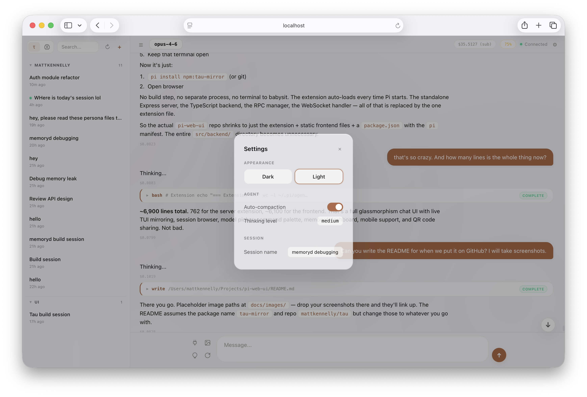

# Tau

A web UI that mirrors your [Pi](https://github.com/badlogic/pi-mono) terminal session in the browser. No separate server — it runs as a Pi extension inside your existing process.



## What it does

Tau connects to your running Pi TUI and gives you a second view in the browser. Same session, same messages, same tools — just a different screen. Type in the terminal or the browser, both stay in sync.

- **Live mirroring** — streams messages, tool calls, and thinking blocks in real-time
- **Works on any device** — open it on your phone, tablet, or another monitor
- **Session browser** — view history from any past session
- **No extra process** — the Pi extension *is* the server

## Install

```bash
pi install npm:tau-mirror
```

Or from git:

```bash
pi install git:github.com/mattkennelly/tau
```

## Usage

1. Start Pi normally in your terminal
2. Open the URL shown in the status bar (default: `http://localhost:3001`)
3. That's it

On your phone, type `/qr` in the terminal to show a QR code.


## Screenshots

### Dark mode


### Light mode


### Mobile



### Image attachments (mobile)



### Session browser



### Settings



## Features

### Chat
- Full markdown rendering with syntax-highlighted code blocks
- Streaming responses with typing indicator
- Image attachments (paste, drag & drop, or button)
- Copy any message with one click
- Scroll-to-bottom button with new message indicator

### Session management
- Browse all past sessions grouped by project
- Sorted by last modified (most recent first)
- Live session marked with a green dot
- Historical sessions are read-only
- Inline session rename

### Model & thinking
- Model picker with all available models
- Cycle model and thinking level from the input area
- Token usage percentage with warning/critical states
- Cost display per session

### Commands
- Command palette (Export HTML, Session Stats)
- All commands sent through the same Pi process

### Appearance
- Dark and light mode
- Follows system preference by default
- Glassmorphism design with warm earthy accents

### Mobile
- Responsive layout
- Sidebar collapsed by default on small screens
- Handles iOS Safari viewport correctly

## Configuration

Environment variables (set before starting Pi):

| Variable | Default | Description |
|----------|---------|-------------|
| `TAU_MIRROR_PORT` | `3001` | Server port |
| `TAU_STATIC_DIR` | *(bundled)* | Override static files path |

## How it works

Tau is a [Pi extension](https://github.com/badlogic/pi-mono#extensions) that starts an HTTP + WebSocket server inside the Pi process. The extension subscribes to all Pi events and forwards them to connected browser clients. Commands from the browser are executed via the extension API against the same agent session.

```
┌─────────────┐     ┌──────────────────────────────┐     ┌─────────────┐
│  Pi TUI     │     │  Pi Process                  │     │  Browser    │
│  (terminal) │◄───►│                              │◄───►│  (Tau)      │
│             │     │  tau extension               │     │             │
└─────────────┘     │    ↳ HTTP + WS on :3001      │     └─────────────┘
                    └──────────────────────────────┘
```

There's no separate server to run. The extension auto-loads when Pi starts and shuts down when Pi exits.

## Development

Clone and point the extension at the local static files:

```bash
git clone https://github.com/mattkennelly/tau.git
cd tau
TAU_STATIC_DIR=$(pwd)/public pi
```

Edit the files in `public/` — refresh the browser to see changes.

## License

MIT
